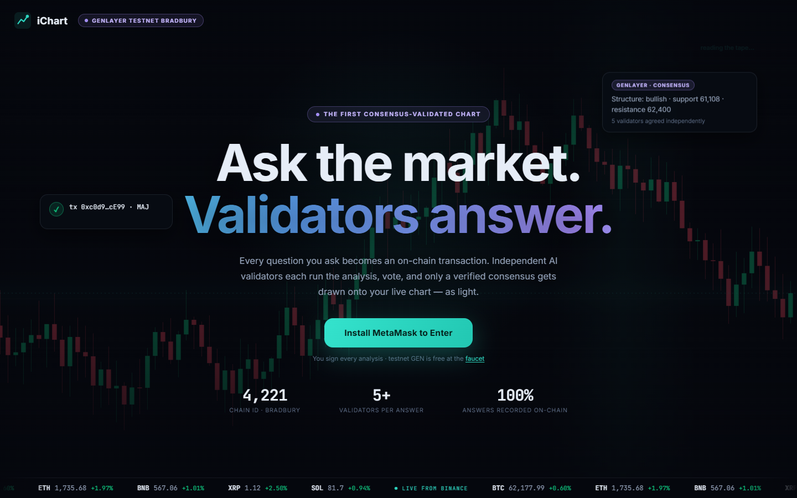
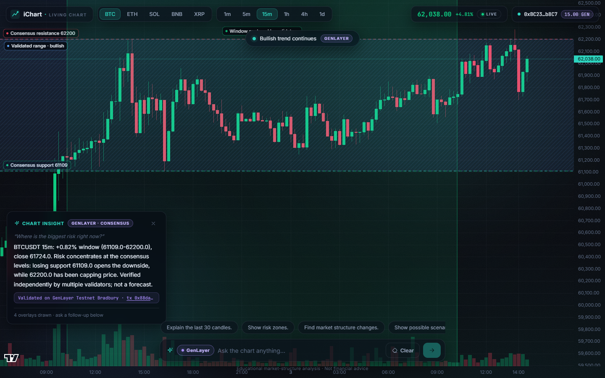
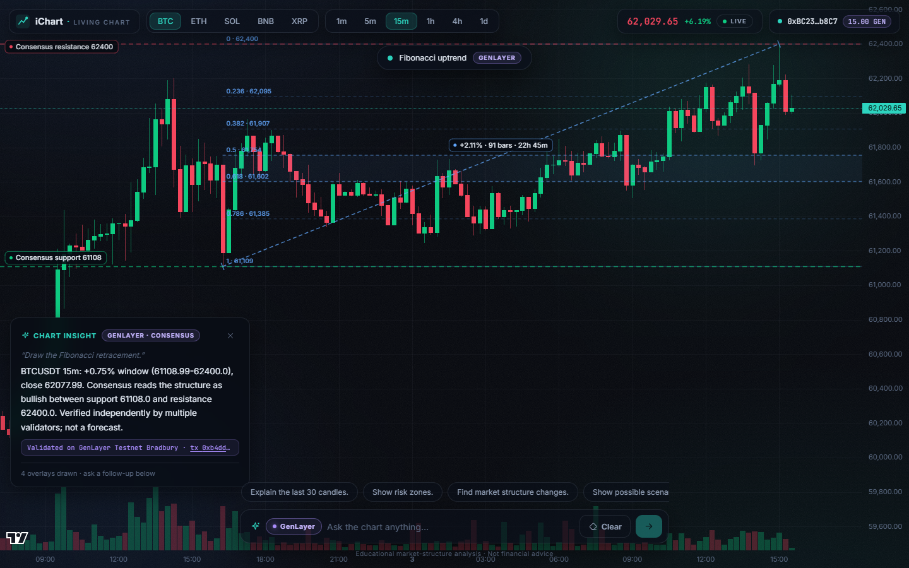
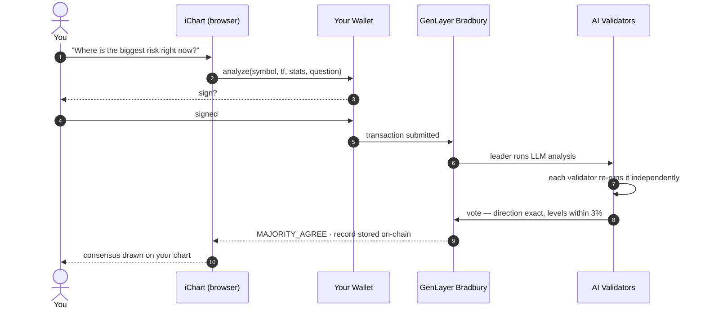
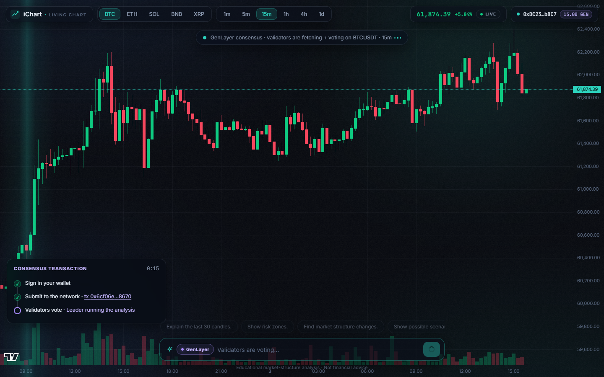

<div align="center">

# iChart

### The chart that answers back.

**Ask any question about live markets. A committee of independent AI validators reaches
consensus on-chain — and draws the answer onto your chart as living light.**

[**Live App**](https://ichart.pages.dev) ·
[**Contract on Bradbury**](https://explorer-bradbury.genlayer.com/address/0x9c939247790c09104e085Ca341188eca372A0C00) ·
[**Free Testnet GEN**](https://testnet-faucet.genlayer.foundation/)




</div>

---

## What is this?

Every AI trading tool on Earth has the same problem: **you're trusting one model's opinion.**

iChart doesn't ask one model. When you ask a question, it becomes **a transaction signed
by your wallet** on [GenLayer](https://genlayer.com)'s Bradbury testnet. A leader validator
runs the analysis; **independent validators — each running their own LLM — re-execute it
and vote.** Only an answer they *agree on* gets recorded on-chain and drawn onto your chart.

No single model. No silent backend. No trust-me-bro. **Consensus, or nothing.**

<div align="center">

</div>

## What it feels like

| | |
|---|---|
| **A living chart** | Real Binance candles streaming over WebSocket, with AI overlays rendered as animated light — Fibonacci with golden pocket, scenario paths, risk zones, consensus levels |
| **Validator committees** | Every answer is independently re-derived by multiple AI validators under GenLayer's Optimistic Democracy — direction must match exactly, levels within 3% |
| **You sign everything** | Your wallet, your keys, your questions. Each analysis is *your* transaction, with the tx hash linked to the Bradbury explorer |
| **Question-aware drawings** | Ask about risk, get risk zones. Ask for Fibonacci, get the full retracement. Ask for scenarios, get animated hypothetical paths. Same verified facts, different lenses |
| **Live consensus telemetry** | A step-by-step transaction panel: sign, submit, validators voting (with the real chain status), and an explicit pass/fail result with retry |
| **Zero backend** | The entire app is static files + your browser + the blockchain. Nothing to host, nothing to trust, nothing running at 3am |

<div align="center">

</div>

## How an answer is born



While validators vote, the app shows the **live pipeline** — queued, leader proposing,
votes committing, revealing — with a running clock. If consensus fails, it tells you
exactly why, with one-click retry. Never a silent fallback.

<div align="center">

</div>

## Architecture

```
+-------------------------  YOUR BROWSER  -------------------------+
|                                                                  |
|  React + Vite + TypeScript · lightweight-charts · canvas         |
|                                                                  |
|   Binance REST/WS ----> live candles (the chart's heartbeat)     |
|   genlayer-js --------> writeContract signed by YOUR wallet      |
|   poll getTransaction + get_latest ----> consensus record        |
|   question router ----> fib / scenarios / risk / trend drawings  |
|                                                                  |
+---------------+---------------------------------+----------------+
                |                                 |
                v                                 v
    Cloudflare Pages (static)         GenLayer Testnet Bradbury
    dist/ + /api/config JSON          IChartAnalyst contract
    no servers, no secrets            validators run the LLMs
```

**The Intelligent Contract** ([`genlayer/contracts/ichart_analyst.py`](genlayer/contracts/ichart_analyst.py)):

| Method | What it does |
|---|---|
| `analyze(symbol, tf, stats, question)` | One LLM judgment under consensus: leader answers, every validator re-runs it in a sandbox and must agree on **direction (exact)** + **support/resistance (within 3%)** |
| `get_latest(symbol)` | Latest consensus record for a symbol |
| `get_history(n)` / `get_history_for(symbol, n)` | The append-only public log of validated analyses |
| `get_record_by_seq(seq)` | Any historical record by its sequence number |
| `get_direction_counts()` | Aggregate verdict statistics across all records |
| `get_contract_info()` | Contract identity card (version, network, tolerances) |

The contract also carries a complete, self-contained technical-analysis reference
library (moving averages, RSI, MACD, Bollinger, pivots, market structure,
Fibonacci, candlestick patterns, event statistics) kept outside the consensus
path by design — every line of a GenLayer contract executes on every validator,
so the live judgment stays minimal while the toolkit remains on-chain as the
canonical reference for auditors and future versions.

The market stats the contract judges are computed from **public, immutable, closed
Binance candles** — anyone can re-audit any record against the recorded window.

## Run it yourself

```bash
git clone https://github.com/abstrusimad/ichart.git
cd ichart
npm install
cp .env.example .env        # add a deployer key only if you'll redeploy the contract
npm run dev                 # -> http://localhost:5173
```

You'll need [MetaMask](https://metamask.io) and free GEN from the
[Bradbury faucet](https://testnet-faucet.genlayer.foundation/) — the app adds the
network to your wallet automatically.

**Redeploy the contract** (optional):

```bash
npm i -g genlayer
genlayer account import --name deployer --private-key $GENLAYER_PRIVATE_KEY
genlayer network set testnet-bradbury
genlayer deploy --contract genlayer/contracts/ichart_analyst.py
# put the printed address in .env -> GENLAYER_CONTRACT_ADDRESS
```

**Ship to production** (Cloudflare Pages, zero servers):

```bash
npm run deploy
```

## Battle scars — building on a consensus chain

Getting LLM consensus to *actually settle* took real archaeology, documented in
[`genlayer/README.md`](genlayer/README.md). The short version:

- **Keep the LLM ask tiny and literal** — one line ending in a JSON example. Prose
  schema descriptions crash executors; every extra generated token lowers agreement odds.
- **Validators re-run work via `gl.vm.spawn_sandbox`**, never by calling nondet
  functions directly from validator context.
- **No floats in deterministic code** — softfloat emulation is a crash fingerprint.
  All numeric work lives inside nondet blocks; records are assembled by string concat.
- **Timeout statuses rotate** — `LEADER_TIMEOUT`/`VALIDATORS_TIMEOUT` are retry states,
  not verdicts. Treat them as final only after they stop changing.
- **One pending tx per sender** — a stuck transaction blocks that wallet's queue.
  User-signed transactions turn this bug into a feature: every user has their own lane.

## What this is not

iChart describes market structure under consensus. It does **not** give financial
advice, signals, predictions, or certainty about the future — by design, in the
contract's own prompt. Educational instrument, testnet economy, real architecture.

---

<div align="center">

**Built with** [GenLayer](https://genlayer.com) · [lightweight-charts](https://github.com/tradingview/lightweight-charts) · [genlayer-js](https://www.npmjs.com/package/genlayer-js) · [viem](https://viem.sh) · React + Vite

*The chart is the AI's body. The chain is its conscience.*

</div>
